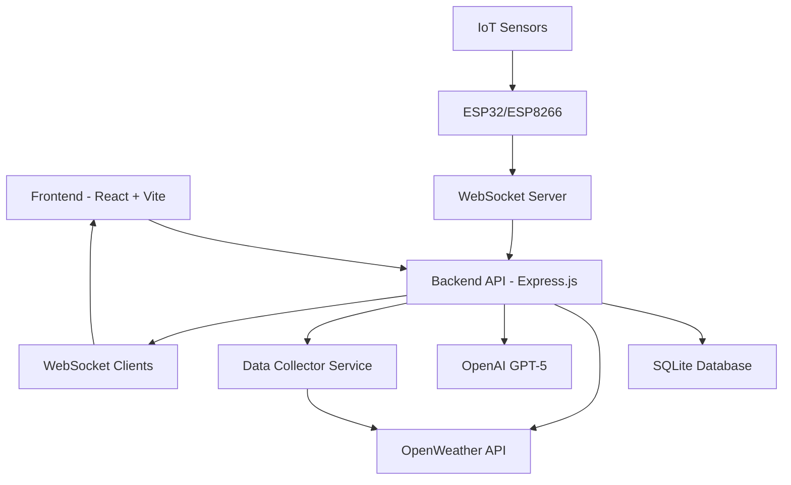

# 🌬️ Bengaluru Air Quality Monitoring & Pollution Prediction System

<div align="center">


**Real-time Air Quality Monitoring, IoT Integration & AI-Powered Pollution Prediction for Bengaluru**

[](https://nodejs.org/)
[](https://reactjs.org/)
[](https://www.typescriptlang.org/)
[](LICENSE)

</div>

---

## 📋 Table of Contents

- [Features](#-features)
- [Architecture](#️-architecture)
- [Quick Start](#-quick-start)
- [Detailed Setup](#-detailed-setup)
- [IoT Hardware Integration](#-iot-hardware-integration)
- [Running the Application](#-running-the-application)
- [API Documentation](#-api-documentation)
- [Troubleshooting](#-troubleshooting)
- [Contributing](#-contributing)

---

## 🌟 Features

### 🔬 **Advanced Analytics & Monitoring**
- ✅ **Real-time Air Quality Monitoring** - Live PM2.5, PM10, NO2, SO2, CO, O3 measurements
- ✅ **IoT Sensor Integration** - Support for MQ-135, DHT11/DHT22, BME280 sensors
- ✅ **AI-Powered Chatbot** - GPT-5 integration for natural language air quality queries
- ✅ **Weather Correlation Analysis** - Complete meteorological data integration
- ✅ **Automated Data Collection** - Scheduler runs every 15 minutes
- ✅ **Multi-City Comparison** - Compare AQI across major Indian cities
- ✅ **Historical Data Tracking** - SQLite database for trend analysis

### 💎 **Premium UI/UX**
- ✅ **Modern Dashboard** - Professional interface with glass morphism effects
- ✅ **Dark Theme Support** - Seamless theme switching
- ✅ **Smooth Animations** - Framer Motion powered transitions with staggered sequences
- ✅ **Interactive Charts** - Real-time data visualization with animated rendering
- ✅ **Responsive Design** - Mobile-first approach with adaptive layouts
- ✅ **Voice Assistant** - Speech recognition and text-to-speech capabilities
- ✅ **Beautiful Gradients** - Modern gradient backgrounds and text effects throughout
- ✅ **Card Hover Effects** - Scale and elevation animations on component interaction
- ✅ **Animated Indicators** - Pulsing legends, rotating icons, and smooth transitions

### 🛡️ **Enterprise Features**
- ✅ **WebSocket Real-time Updates** - Live IoT sensor data streaming
- ✅ **Health Advisory System** - Smart recommendations based on air quality levels
- ✅ **Data Export** - Download historical data in CSV/JSON format
- ✅ **Comprehensive Error Handling** - Robust error management
- ✅ **Automated Backups** - Database backup and retention policies

---

## 🎨 UI/UX Animation & Design

All interface components feature smooth, professional animations powered by **Framer Motion**:

### Component Animations
- **AQI Card:** Fade-in + scale animation on mount, pulsing value indicators, smooth color transitions
- **Weather Card:** Slide-in animation, rotating thermometer icon, staggered metric rendering
- **Pollutant Card:** Spring-based scale animations, animated progress bars, pulsing status indicators
- **Charts:** Gradient-filled areas, animated data rendering, smooth tooltip transitions, legend pulse effects
- **Health Advisory:** Rotating warning icons, staggered recommendation list, animated alert boxes

### Global Effects
- **Page Transitions:** Smooth fade-in-up animations on page load (600ms)
- **Interactive Hover:** All cards scale +2% and elevate -4px on hover with smooth easing
- **Button Interactions:** 300ms transition animations with feedback on click
- **Loading States:** Animated spinners and shimmer effects for data fetching
- **Glassmorphism:** Semi-transparent cards with backdrop blur for modern aesthetic

### CSS Animations
- `fadeInUp`: Fade + slide animation (0.6s)
- `slideInLeft/Right`: Side-entrance animations (0.5s)
- `pulse-glow`: Glowing effect for attention-grabbing elements (2s loop)
- `shimmer`: Loading placeholder animation (3s loop)
- `float`: Gentle up/down floating motion (3s loop)
- `gradient-shift`: Animated gradient background (6s loop)

---

## 🏗️ Architecture



**Technology Stack:**
- **Frontend:** React 18, TypeScript, Vite, Tailwind CSS, shadcn/ui, Framer Motion
- **Backend:** Node.js, Express.js, WebSocket (ws)
- **Database:** SQLite3 with better-sqlite3
- **AI/ML:** OpenAI GPT-5 API
- **External APIs:** OpenWeather API for real-time data
- **IoT:** ESP32/ESP8266 with MQ-135, DHT22, BME280 sensors

---

## ⚡ Quick Start

### Prerequisites Checklist

Before starting, ensure you have:

- [ ] **Node.js 18+** installed ([Download here](https://nodejs.org/))
- [ ] **npm 8+** package manager
- [ ] **OpenWeather API Key** ([Get free key](https://openweathermap.org/api))
- [ ] **OpenAI API Key** (optional, for AI chatbot features)
- [ ] **4GB+ RAM** recommended
- [ ] **Stable internet connection**

### 🚀 One-Command Setup

```bash
# Clone the repository
git clone <repository-url>
cd air-quality-monitoring

# Install dependencies
npm install --legacy-peer-deps

# Configure environment variables
cp .env.example .env
# Edit .env and add your API keys

# Start the application
npm run dev
```

---

## 🔧 Detailed Setup

### Step 1: Clone Repository

```bash
git clone <repository-url>
cd air-quality-monitoring
```

### Step 2: Install Dependencies

```bash
npm install --legacy-peer-deps
```

### Step 3: Configure Environment Variables

Create a `.env` file in the project root:

```env
# 🌤️ OpenWeather API (REQUIRED)
OPENWEATHER_API_KEY=your_openweather_api_key_here

# 🤖 OpenAI API (Optional - for AI chatbot features)
OPENAI_API_KEY=your_openai_api_key_here

# 🖥️ Server Configuration
PORT=5000
NODE_ENV=development

# 💾 Database
DB_PATH=./data/air_quality.db

# 🔐 Session (Optional)
SESSION_SECRET=your_secure_session_secret_here
```

### Step 4: Get OpenWeather API Key

1. 🌐 Visit [OpenWeather API](https://openweathermap.org/api)
2. 📝 Sign up for a free account
3. 🔑 Generate API key (takes ~10 minutes to activate)
4. 📋 Copy key to `.env` file as `OPENWEATHER_API_KEY`

> **💡 Tip:** Free tier includes 1000 calls/day with air pollution data

### Step 5: Get OpenAI API Key (Optional)

1. 🌐 Visit [OpenAI Platform](https://platform.openai.com/api-keys)
2. 📝 Create an API key
3. 📋 Add to `.env` file as `OPENAI_API_KEY`

---

## 🔌 IoT Hardware Integration

This system supports real-time data collection from IoT air quality sensors. For complete hardware setup instructions, see [IOT_HARDWARE_INTEGRATION.md](./IOT_HARDWARE_INTEGRATION.md).

### Supported Sensors

| Sensor | Purpose | Interface | Accuracy |
|--------|---------|-----------|----------|
| **MQ-135** | Air quality (NH3, NOx, CO2, benzene, smoke) | Analog | ±10% |
| **DHT22** | Temperature & Humidity | Digital (1-wire) | ±0.5°C, ±2% RH |
| **BME280** | Temperature, Humidity, Pressure | I2C/SPI | ±1°C, ±3% RH, ±1 hPa |

### Quick IoT Setup

**Hardware Requirements:**
- ESP32 or ESP8266 microcontroller
- MQ-135 Air Quality Sensor
- DHT22 or BME280 sensor
- Power supply (5V DC)
- Breadboard and jumper wires

**Software Requirements:**
- Arduino IDE
- Required libraries: WiFi, WebSocketsClient, ArduinoJson, DHT, Adafruit BME280

**Basic Wiring:**
```
ESP32 Pinout:
GPIO 32 (ADC) ← MQ-135 A0
GPIO 4        ← DHT22 DATA
GPIO 21 (SDA) ← BME280 SDA
GPIO 22 (SCL) ← BME280 SCL
3.3V          → Sensors VCC
GND           → Sensors GND
```

**WebSocket Connection:**

The ESP32/ESP8266 connects to the server via WebSocket and sends data every 30 seconds:

```json
{
  "type": "iot_reading",
  "deviceId": "iot-bengaluru-001",
  "location": "Bengaluru Central",
  "pm25": 35.5,
  "pm10": 68.2,
  "temperature": 28.5,
  "humidity": 65.0,
  "batteryLevel": 85,
  "signalStrength": 78
}
```

For complete Arduino code, circuit diagrams, and troubleshooting, see [IOT_HARDWARE_INTEGRATION.md](./IOT_HARDWARE_INTEGRATION.md).

---

## 🚀 Running the Application

### Method 1: Development Mode (Recommended)

```bash
npm run dev
```

This will start:
- 🖥️ **Backend API:** http://localhost:5000
- 🌐 **Frontend App:** http://localhost:5000
- 📊 **WebSocket Server:** ws://localhost:5000/ws

### Method 2: Production Mode

```bash
# Build the application
npm run build

# Start production server
npm start
```

### What Happens on Startup

1. ✓ Express server starts on port 5000
2. ✓ SQLite database initializes
3. ✓ OpenWeather API connection verified
4. ✓ WebSocket server starts for IoT devices
5. ✓ Automated data collection begins (every 15 minutes)
6. ✓ Frontend served via Vite (development) or static files (production)

---

## 🔍 Troubleshooting

### Common Issues & Solutions

#### ❌ **"Failed to fetch air quality data"**

**Causes & Solutions:**

1. **API Key Issues:**
   ```bash
   # Check if API key is set
   grep OPENWEATHER_API_KEY .env

   # Test API key
   curl "http://api.openweathermap.org/data/2.5/weather?lat=12.9716&lon=77.5946&appid=YOUR_API_KEY"
   ```

2. **Backend Not Running:**
   ```bash
   # Check if server is running
   curl http://localhost:5000/api/aqi/bengaluru

   # Restart server
   npm run dev
   ```

3. **API Key Not Activated:**
   - OpenWeather API keys take 10-20 minutes to activate after creation
   - Wait and try again

#### ❌ **"npm install" Fails**

**Solution:**
```bash
# Use legacy peer deps flag
npm install --legacy-peer-deps

# Or clean install
rm -rf node_modules package-lock.json
npm install --legacy-peer-deps
```

#### ❌ **"Database Error" or "Cannot open database"**

**Solution:**
```bash
# Create data directory
mkdir -p data

# Check permissions
ls -la data/

# Restart server
npm run dev
```

#### ❌ **"WebSocket connection failed"**

**Solution:**
- Ensure server is running on port 5000
- Check firewall settings
- Verify WebSocket path is `/ws`
- Check IoT device configuration (WiFi, server IP)

#### ❌ **"IoT sensor not sending data"**

**Solution:**
- Check Arduino serial monitor for errors (115200 baud)
- Verify WiFi credentials in ESP32 code
- Ensure WebSocket server URL is correct
- Check sensor wiring and power supply
- Review [IOT_HARDWARE_INTEGRATION.md](./IOT_HARDWARE_INTEGRATION.md) for sensor-specific troubleshooting

#### ❌ **"AI Chatbot not responding"**

**Solution:**
- Verify `OPENAI_API_KEY` is set in `.env`
- Check OpenAI API quota and billing
- System will use fallback responses if API is unavailable
- Check browser console for errors

### 🔧 Debug Mode

```bash
# Enable detailed logging
DEBUG=* npm run dev

# Check system logs
tail -f logs/app.log

# Test API endpoints
curl http://localhost:5000/api/aqi/bengaluru
curl http://localhost:5000/api/weather/bengaluru
curl http://localhost:5000/api/cities/supported
```

---

## 📊 API Documentation

### Base URL
```
Development: http://localhost:5000/api
```

### Key Endpoints

#### Air Quality
```bash
# Current AQI data
GET /api/aqi/:location
Example: GET /api/aqi/bengaluru

# Historical data
GET /api/aqi/:location/history?limit=24
Example: GET /api/aqi/bengaluru/history?limit=24
```

#### Multi-City Comparison
```bash
POST /api/cities/compare
Content-Type: application/json

{
  "cities": ["bengaluru", "delhi", "mumbai", "chennai"]
}
```

#### Weather Data
```bash
GET /api/weather/:location
Example: GET /api/weather/bengaluru
```

#### AI Chatbot
```bash
POST /api/chat
Content-Type: application/json

{
  "message": "What's the current AQI?",
  "sessionId": "user-123",
  "location": "Bengaluru Central"
}
```

#### Voice Assistant
```bash
POST /api/voice
Content-Type: application/json

{
  "transcript": "Is it safe to exercise outside?",
  "sessionId": "user-123",
  "location": "Bengaluru Central"
}
```

#### Data Export
```bash
POST /api/export
Content-Type: application/json

{
  "format": "csv",
  "dateRange": {
    "from": "2025-10-01",
    "to": "2025-10-10"
  },
  "dataTypes": {
    "aqi": true,
    "pollutants": true,
    "weather": true
  },
  "locations": ["Bengaluru Central"],
  "includeMetadata": true
}
```

#### Supported Cities
```bash
GET /api/cities/supported

Response:
{
  "cities": [
    {"name": "Bengaluru", "lat": 12.9716, "lon": 77.5946, "state": "Karnataka"},
    {"name": "Delhi", "lat": 28.6139, "lon": 77.2090, "state": "Delhi"},
    ...
  ]
}
```

### WebSocket API

Connect to `ws://localhost:5000/ws` for real-time updates.

**Client → Server (IoT Device):**
```json
{
  "type": "iot_reading",
  "deviceId": "iot-bengaluru-001",
  "location": "Bengaluru Central",
  "pm25": 35.5,
  "pm10": 68.2,
  "temperature": 28.5,
  "humidity": 65.0,
  "batteryLevel": 85,
  "signalStrength": 78
}
```

**Server → Client (Broadcast):**
```json
{
  "type": "iot_update",
  "deviceId": "iot-bengaluru-001",
  "location": "Bengaluru Central",
  "data": { ... },
  "timestamp": "2025-10-10T10:30:00Z"
}
```

---

## 🎯 Features Walkthrough

### 📊 **Dashboard Overview**
- Real-time AQI display with color-coded health status
- Interactive charts showing pollution trends
- Weather integration with current conditions
- Multi-city comparison view
- IoT device monitoring panel

### 🤖 **AI Assistant**
- Natural language air quality queries
- Voice command support (Chrome/Edge)
- Context-aware health recommendations
- Historical data insights

### 📡 **IoT Integration**
- Real-time sensor data from ESP32/ESP8266
- Live device status monitoring
- Battery and signal strength indicators
- Automatic reconnection on failure

### 📈 **Analytics**
- Historical trend analysis
- Pollutant breakdown (PM2.5, PM10, CO, O3, NO2, SO2)
- Weather correlation
- Data quality metrics

### 📥 **Data Export**
- Export to CSV or JSON
- Custom date ranges
- Select specific data types
- Include metadata options

---

## 🚀 Project Structure

```
air-quality-monitoring/
├── client/                      # React frontend
│   ├── src/
│   │   ├── components/          # UI components
│   │   │   ├── ui/              # shadcn/ui components
│   │   │   ├── AQICard.tsx      # AQI display card
│   │   │   ├── AIChatbot.tsx    # AI chatbot component
│   │   │   ├── IoTDeviceMonitor.tsx  # IoT device monitor
│   │   │   └── ...
│   │   ├── pages/               # Page components
│   │   │   ├── Dashboard.tsx    # Main dashboard
│   │   │   ├── AirQuality.tsx   # Detailed AQI view
│   │   │   └── ...
│   │   ├── hooks/               # Custom React hooks
│   │   └── lib/                 # Utilities
│   └── index.html
├── server/                      # Express backend
│   ├── services/                # Business logic
│   │   ├── openWeatherService.ts    # OpenWeather API integration
│   │   ├── aiService.ts             # OpenAI GPT integration
│   │   ├── voiceService.ts          # Voice processing
│   │   └── dataCollector.ts         # Automated data collection
│   ├── routes.ts                # API routes
│   ├── storage.ts               # Database layer
│   └── index.ts                 # Server entry point
├── shared/                      # Shared types/schemas
│   └── schema.ts
├── IOT_HARDWARE_INTEGRATION.md  # IoT hardware guide
├── README.md                    # This file
├── .env                         # Environment variables
└── package.json
```

---

## 🤝 Contributing

We welcome contributions! Here's how to get started:

### Development Workflow

1. **Fork the repository**
2. **Create feature branch:** `git checkout -b feature/amazing-feature`
3. **Install dependencies:** `npm install --legacy-peer-deps`
4. **Start development:** `npm run dev`
5. **Make changes and test**
6. **Commit:** `git commit -m 'Add amazing feature'`
7. **Push:** `git push origin feature/amazing-feature`
8. **Create Pull Request**

### Code Standards
- **TypeScript:** Strict mode enabled
- **Formatting:** Prettier for code formatting
- **Components:** Follow React best practices
- **Commits:** Use descriptive commit messages

---

## 📄 License

This project is licensed under the MIT License - see the LICENSE file for details.

---

## 🙏 Acknowledgments

- **OpenWeather API** for comprehensive environmental data
- **OpenAI** for GPT-5 API access
- **React/Vite Community** for excellent documentation
- **shadcn/ui** for beautiful UI components
- **Bengaluru Air Quality Board** for validation data
- **Open Source Community** for amazing tools and libraries

---

## 🧠 Machine Learning Predictions

This project includes a lightweight, server-side time-series forecasting implementation used for short-term AQI and temperature predictions. The goal is to provide reliable near-term forecasts without heavy external dependencies so it can run on modest servers.

- Model implemented: **ARIMA-like Auto-Regressive (AR) Model with Mean-Reversion Dampening**
  - Uses Yule-Walker method to estimate AR coefficients from autocorrelation function (ACF)
  - Implements multi-step-ahead forecasting with mean-reversion dampening (0.7×prediction + 0.3×mean) to prevent explosive drift
  - Calculates residual standard deviation to score confidence (inverse relationship: lower residuals = higher confidence)
  - Lightweight, pure TypeScript implementation with no external ML dependencies
  - Implemented in `server/services/arimaPredictor.ts` and wired into `server/services/predictionService.ts`

- How it works:
  1. The service reads recent hourly AQI and temperature readings from in-memory storage (typically 48+ hours of data)
  2. Autocorrelation is computed at lags 0 to p (default p=3) using the autocorrelation function
  3. Yule-Walker equations solve for AR coefficients that minimize residual error
  4. Multi-step forecasts are generated using the fitted AR model: `predicted[t+h] = c + Σ(φᵢ × observed[t+1-i]) + dampening`
  5. Dampening factor (0.7×pred + 0.3×mean) prevents unrealistic trend extrapolation
  6. Confidence score is computed: `confidence = max(40, min(90, round(85 - residualStd × 2)))`
  7. Hourly forecasts are aggregated to daily (min/avg/max) for weekly summaries

- Why this choice:
  - **Superior to simple smoothing:** AR models capture autocorrelation structure in time series, making them more accurate than exponential smoothing alone
  - **No external dependencies:** Pure TypeScript implementation; no scikit-learn, statsmodels, or heavy Python bridges required
  - **Handles small datasets:** Yule-Walker method works well with 20-50 observations (typical in live IoT scenarios)
  - **Mean-reversion prevents drift:** Unlike pure AR, the dampening factor prevents model from extrapolating trends to unrealistic levels
  - **Production-ready:** Runs efficiently on modest hardware (IoT gateways, Raspberry Pi, cloud edge nodes)
  - **Interpretable:** AR coefficients show how recent values influence forecasts; confidence scores guide user trust

- Algorithm details:
  - **ACF Computation:** For each lag k (0 to p), correlation coefficient is computed between series and its k-lagged self
  - **Yule-Walker Equations:** Solves system: `Σ(φⱼ × acf[|i-j|]) = acf[i]` for i=1..p to get coefficients φ₁..φₚ
  - **Forecast generation:** Each step ahead uses: `ŷ[t+h] = φ₁×y[t+h-1] + φ₂×y[t+h-2] + ... + φₚ×y[t+h-p]` with dampening applied
  - **Confidence scoring:** Based on residual standard deviation; wider prediction errors → lower confidence

- Limitations & future improvements:
  - **No seasonality modeling:** Current AR(p) does not capture daily/weekly cycles explicitly. For seasonal AQI patterns, consider SARIMA or seasonal AR
  - **Stationary assumption:** AR model assumes time series is stationary (constant mean/variance). Non-stationary data may require differencing first
  - **Short-term only:** Forecasts degrade quickly beyond 24 hours due to dampening and lack of external regressors (weather, day-of-week, etc.)
  - **Future enhancements:**
    - Add SARIMAX (seasonal AR) to capture daily pollution cycles
    - Integrate exogenous weather features (temperature, humidity, wind speed) as regressors
    - Implement Kalman filtering for adaptive AR coefficients
    - Train small LSTM on historical data for non-linear patterns (optional GPU acceleration)

- How to use the prediction endpoints:
  - Hourly AQI: `GET /api/ml/hourly?location=Bengaluru Central&timeframe=24h`
  - Weekly AQI: `GET /api/ml/weekly?location=Bengaluru Central&days=7`
  - Predictions include `{time, actual, predicted, confidence}` for each forecast point


## 📞 Support

### Getting Help

- 📖 **Documentation:** Check this README and IoT guide
- 🐛 **Bug Reports:** Create GitHub issue
- 💡 **Feature Requests:** Open GitHub discussion
- 🔧 **Troubleshooting:** See troubleshooting section above

### Quick Links

- **IoT Integration Guide:** [IOT_HARDWARE_INTEGRATION.md](./IOT_HARDWARE_INTEGRATION.md)
- **OpenWeather API:** [https://openweathermap.org/api](https://openweathermap.org/api)
- **OpenAI Platform:** [https://platform.openai.com](https://platform.openai.com)

---

<div align="center">

**🌱 Built with passion for cleaner air and better health in Bengaluru 🇮🇳**

*Last updated: October 2025*

---

### ⚡ Quick Start Checklist

- [ ] Node.js 18+ installed
- [ ] Clone repository
- [ ] Run `npm install --legacy-peer-deps`
- [ ] Get OpenWeather API key from [openweathermap.org/api](https://openweathermap.org/api)
- [ ] Create `.env` file and add `OPENWEATHER_API_KEY`
- [ ] Run `npm run dev`
- [ ] Open http://localhost:5000
- [ ] (Optional) Setup IoT sensors using [IOT_HARDWARE_INTEGRATION.md](./IOT_HARDWARE_INTEGRATION.md)

**🆘 Need help?** Check the [troubleshooting section](#-troubleshooting) or create an issue!

</div>
